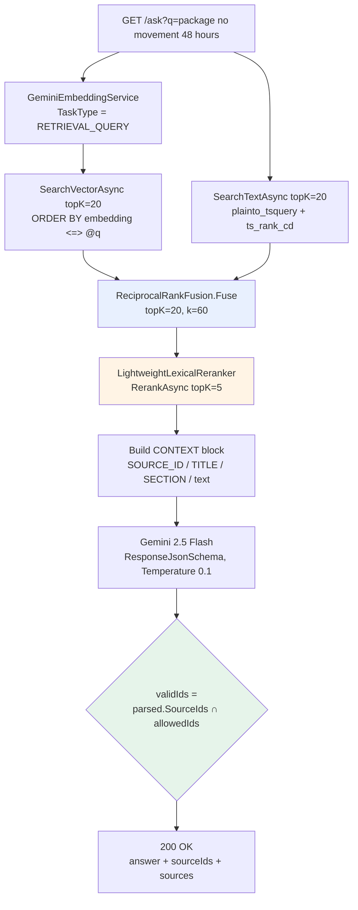
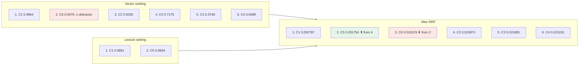
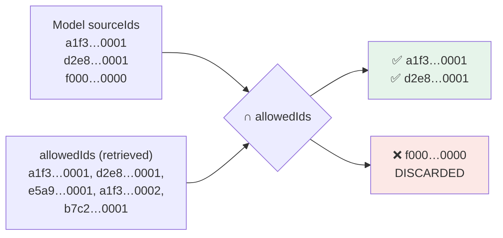

# Project 08 — RerankingCitationsRag: A Fully Worked Example

This document traces **one request** through `GET /ask` end to end, with real sample data and every number computed by hand.

To keep the arithmetic checkable, embeddings below are shown as **4-dimensional toy vectors**. The real system uses `gemini-embedding-001` at **768 dimensions** — the maths is identical, just wider.

---

## 0. The Pipeline at a Glance



Code path: [`Program.cs`](Program.cs) → [`RetrievalPipeline`](Retrieval.cs) → [`PostgresVectorStore`](PostgresVectorStore.cs).

---

## 1. Sample Corpus

Six rows in `document_chunks` (all `status = 'Active'`). GUIDs are the deterministic `SHA256(chunkId)[0..16]` values produced by the ingestion service in project 06 — the ones shown here are **illustrative placeholders**, but they are stable per chunk in a real run.

| Ref | `id` (uuid) | `title` | `section` | `text` |
|---|---|---|---|---|
| **C1** | `a1f3…0001` | Lost Package Policy | Escalation | *Packages with **no** tracking **movement** for **48 hours** must be escalated to the Package Investigation Team.* |
| **C2** | `a1f3…0002` | Lost Package Policy | Definitions | *A package **cannot** be marked delayed until carrier scans stop before the destination hub.* |
| **C3** | `b7c2…0001` | Damaged Shipment Procedure | Claims | *Damaged shipments must be photographed and submitted to the claims processing team within 24 **hours**.* |
| **C4** | `c9d4…0001` | Password Reset Procedure | Access | *Employees reset forgotten passwords through the corporate identity portal.* |
| **C5** | `d2e8…0001` | Investigation Team Charter | Intake | *The Package Investigation Team opens a case when a package shows **no movement** beyond the policy threshold of **48 hours**.* |
| **C6** | `e5a9…0001` | Customs Delay Guidance | Transit | *Packages held in customs may show **no movement** for several days while awaiting clearance.* |

**C6 is a deliberate distractor**: semantically it looks a lot like the query ("packages", "no movement"), but it contains no 48-hour rule. Watch what each stage does with it.

### Toy embeddings

Four synthetic dimensions: `d0` = delay/tracking, `d1` = escalation/investigation, `d2` = damage/claims, `d3` = credentials.

| Ref | Embedding |
|---|---|
| C1 | `[0.90, 0.40, 0.10, 0.00]` |
| C2 | `[0.80, 0.10, 0.10, 0.00]` |
| C3 | `[0.20, 0.30, 0.90, 0.00]` |
| C4 | `[0.00, 0.10, 0.00, 0.95]` |
| C5 | `[0.30, 0.90, 0.20, 0.00]` |
| C6 | `[0.70, 0.20, 0.20, 0.10]` |

---

## 2. Step 1 — Embed the Query

```
GET /ask?q=package no movement 48 hours
```

`RetrievalPipeline.RetrieveAsync` calls:

```csharp
var queryVector = await embeddings.GenerateQueryEmbeddingAsync(query, cancellationToken);
```

which hits `EmbedContentAsync` with **`TaskType = "RETRIEVAL_QUERY"`** (documents were embedded with `RETRIEVAL_DOCUMENT`).

Result:

```
q = [0.85, 0.45, 0.05, 0.00]
```

**Why the asymmetry matters:** the model projects short questions and long passages into the *same* space but from different starting distributions. Using `RETRIEVAL_DOCUMENT` for a query is a silent quality bug — nothing throws, recall just quietly drops.

---

## 3. Step 2 — Vector Search (the maths)

### 3.1 The formula

pgvector's `<=>` operator is **cosine distance**:

$$
\text{distance} = 1 - \cos(\theta) = 1 - \frac{\mathbf{a}\cdot\mathbf{b}}{\lVert\mathbf{a}\rVert\,\lVert\mathbf{b}\rVert}
$$

The SQL in `SearchVectorAsync` therefore inverts it to get a human-friendly similarity:

```sql
SELECT id, document_id, title, section, text, source_uri,
	   1 - (embedding <=> @embedding) AS similarity
FROM document_chunks
WHERE status = 'Active'
ORDER BY embedding <=> @embedding
LIMIT @topK;          -- topK = 20
```

Note it **orders by distance ascending** (nearest first) but **selects similarity**. Same ordering, two readings.

### 3.2 Query magnitude

$$
\lVert q \rVert = \sqrt{0.85^2 + 0.45^2 + 0.05^2 + 0^2} = \sqrt{0.7225 + 0.2025 + 0.0025} = \sqrt{0.9275} = 0.96307
$$

### 3.3 Per-chunk computation

**C1** — `[0.90, 0.40, 0.10, 0.00]`
```
dot  = 0.85(0.90) + 0.45(0.40) + 0.05(0.10) + 0
	 = 0.7650 + 0.1800 + 0.0050 = 0.9500
‖d‖  = √(0.81 + 0.16 + 0.01) = √0.98 = 0.98995
cos  = 0.9500 / (0.96307 × 0.98995) = 0.9500 / 0.95339 = 0.99644
```

**C6** — `[0.70, 0.20, 0.20, 0.10]`
```
dot  = 0.5950 + 0.0900 + 0.0100 + 0 = 0.6950
‖d‖  = √(0.49 + 0.04 + 0.04 + 0.01) = √0.58 = 0.76158
cos  = 0.6950 / (0.96307 × 0.76158) = 0.6950 / 0.73344 = 0.94759
```

**C2** — `[0.80, 0.10, 0.10, 0.00]`
```
dot  = 0.6800 + 0.0450 + 0.0050 = 0.7300
‖d‖  = √0.66 = 0.81240
cos  = 0.7300 / 0.78239 = 0.93304
```

**C5** — `[0.30, 0.90, 0.20, 0.00]`
```
dot  = 0.2550 + 0.4050 + 0.0100 = 0.6700
‖d‖  = √0.94 = 0.96954
cos  = 0.6700 / 0.93375 = 0.71754
```

**C3** — `[0.20, 0.30, 0.90, 0.00]`
```
dot  = 0.1700 + 0.1350 + 0.0450 = 0.3500
‖d‖  = √0.94 = 0.96954
cos  = 0.3500 / 0.93375 = 0.37483
```

**C4** — `[0.00, 0.10, 0.00, 0.95]`
```
dot  = 0 + 0.0450 + 0 + 0 = 0.0450
‖d‖  = √0.9125 = 0.95525
cos  = 0.0450 / 0.91999 = 0.04891
```

### 3.4 Vector result set

| Vector rank (0-based) | Ref | `similarity` = `1 - <=>` | `<=>` distance |
|---|---|---|---|
| 0 | **C1** | 0.99644 | 0.00356 |
| 1 | **C6** | 0.94759 | 0.05241 |
| 2 | **C2** | 0.93304 | 0.06696 |
| 3 | **C5** | 0.71754 | 0.28246 |
| 4 | **C3** | 0.37483 | 0.62517 |
| 5 | **C4** | 0.04891 | 0.95109 |

> **Observation:** the distractor **C6 ranks 2nd**, while the genuinely useful **C5 ranks 4th**. Pure vector search got the *shape* of the question right and the *facts* wrong. This is precisely the gap the next two stages close.

📐 For the full geometry behind these numbers — angles, unit vectors, scale invariance, cosine vs Euclidean, and graphs — see [`../COSINE-SIMILARITY-DEEP-DIVE.md`](../COSINE-SIMILARITY-DEEP-DIVE.md).

**Remember:** the HNSW index makes this **approximate**. On six rows it is exact; on six million it may skip a true neighbour. Over-fetching (`topK = 20`) is partly insurance against that.

---

## 4. Step 3 — Lexical Search (the maths)

Runs **concurrently** with the vector search:

```csharp
var vectorTask  = store.SearchVectorAsync(queryVector, 20, cancellationToken);
var lexicalTask = store.SearchTextAsync(query, 20, cancellationToken);
await Task.WhenAll(vectorTask, lexicalTask);
```

### 4.1 Query → tsquery

```sql
SELECT plainto_tsquery('english', 'package no movement 48 hours');
```

`plainto_tsquery` lowercases, drops stopwords, stems, and **ANDs** what remains:

| Token | Fate |
|---|---|
| `package` | stems → `packag` |
| `no` | English **stopword** → dropped |
| `movement` | stems → `movement` |
| `48` | numeric lexeme → `48` |
| `hours` | stems → `hour` |

$$
\texttt{'packag' \& 'movement' \& '48' \& 'hour'}
$$

> ⚠️ **Critical gotcha:** `plainto_tsquery` uses **AND**, not OR. Every lexeme must be present. A long natural-language question will frequently match **nothing**. If you want OR/phrase behaviour you need `websearch_to_tsquery` or `to_tsquery` with explicit operators.

### 4.2 Matching against the generated `search_vector`

The column is computed by the schema, so it can never drift from the text:

```sql
search_vector tsvector GENERATED ALWAYS AS (
  to_tsvector('english',
	coalesce(title,'') || ' ' || coalesce(section,'') || ' ' || coalesce(text,''))
) STORED
```

| Ref | `packag` | `movement` | `48` | `hour` | All present? |
|---|:--:|:--:|:--:|:--:|:--:|
| C1 | ✅ | ✅ | ✅ | ✅ | **MATCH** |
| C2 | ✅ | ❌ | ❌ | ❌ | no |
| C3 | ❌ | ❌ | ❌ | ✅ | no |
| C4 | ❌ | ❌ | ❌ | ❌ | no |
| C5 | ✅ | ✅ | ✅ | ✅ | **MATCH** |
| C6 | ✅ | ✅ | ❌ | ❌ | no |

The lexical leg **eliminates the distractor C6 outright** — it has the vibe but not the `48`/`hours` tokens.

### 4.3 Ranking the matches

```sql
ORDER BY ts_rank_cd(search_vector, plainto_tsquery('english', @query)) DESC
```

`ts_rank_cd` is *cover density* ranking: it rewards matched lexemes that appear **close together**, and divides by the length of the shortest covering window. C1 packs `movement … 48 hours` into six words; C5 spreads them wider.

| Lexical rank | Ref | `ts_rank_cd` |
|---|---|---|
| 0 | **C1** | 0.0891 |
| 1 | **C5** | 0.0664 |

**Remember:** `ts_rank_cd` values are tiny, unbounded-ish floats on a completely different scale from cosine similarity (0–1). **They are not comparable.** That is the entire justification for the next step.

---

## 5. Step 4 — Reciprocal Rank Fusion (the maths)

```csharp
scores[result.Id] = scores.GetValueOrDefault(result.Id) + 1d / (k + rank + 1);
```

with `k = 60` and `rank` 0-based, so the denominator is `60 + rank + 1`.

$$
\text{RRF}(d) = \sum_{r \in \text{retrievers}} \frac{1}{k + \text{rank}_r(d) + 1}
$$

### 5.1 Contributions

| Ref | Vector rank → term | Lexical rank → term | **Total** |
|---|---|---|---|
| **C1** | 0 → 1/61 = 0.0163934 | 0 → 1/61 = 0.0163934 | **0.0327869** |
| **C5** | 3 → 1/64 = 0.0156250 | 1 → 1/62 = 0.0161290 | **0.0317540** |
| **C6** | 1 → 1/62 = 0.0161290 | — | **0.0161290** |
| **C2** | 2 → 1/63 = 0.0158730 | — | **0.0158730** |
| **C3** | 4 → 1/65 = 0.0153846 | — | **0.0153846** |
| **C4** | 5 → 1/66 = 0.0151515 | — | **0.0151515** |

### 5.2 The rank shuffle



**Why RRF works here:** C5 was only 4th on vectors, but appearing on **both** lists earned it two contributions (0.01563 + 0.01613). C6 appeared on **one** list and, despite a high 0.9476 cosine score, collected a single 0.01613. **Agreement between independent retrievers beats a strong score from one of them.**

**Why `k = 60`:** it flattens the curve. Without it, rank 0 (`1/1 = 1.0`) would be 2× rank 1 (`1/2 = 0.5`) — the top hit of a single retriever would dominate everything. With `k = 60`, ranks 0 and 1 differ by only ~1.6%, so **consensus outweighs position**. 60 is the value from the original Cormack et al. paper and is the de-facto default.

`Fuse(..., topK: 20)` returns all six here (fewer than 20 candidates exist).

---

## 6. Step 5 — Reranking (the maths)

```csharp
return await reranker.RerankAsync(query, fused, 5, cancellationToken);
```

`LightweightLexicalReranker` splits the **raw query string** on spaces, de-duplicates case-insensitively:

```
terms = ["package", "no", "movement", "48", "hours"]      // note: "no" is NOT dropped here
```

Score = count of terms where `Text.Contains(term, OrdinalIgnoreCase)` **or** `Title.Contains(term, OrdinalIgnoreCase)`. This is **raw substring matching — no stemming, no stopword removal**.

| Ref | `package` | `no` | `movement` | `48` | `hours` | **Score** |
|---|:--:|:--:|:--:|:--:|:--:|:--:|
| **C1** | ✅ *Packages* | ✅ *no* | ✅ | ✅ | ✅ | **5** |
| **C5** | ✅ *Package* | ✅ *no* | ✅ | ✅ | ✅ | **5** |
| **C6** | ✅ *Packages* | ✅ *no* | ✅ | ❌ | ❌ | **3** |
| **C2** | ✅ *package* | ⚠️ ✅ *can**no**t* | ❌ | ❌ | ❌ | **2** |
| **C3** | ❌ | ❌ | ❌ | ❌ | ✅ *hours* | **1** |
| **C4** | ❌ | ❌ | ❌ | ❌ | ❌ | **0** |

Then `.OrderByDescending(Score).Take(5)`:

| Final rank | Ref | Score |
|---|---|---|
| 1 | **C1** | 5 |
| 2 | **C5** | 5 |
| 3 | **C6** | 3 |
| 4 | **C2** | 2 |
| 5 | **C3** | 1 |

C4 is dropped.

### Two teaching points hiding in this table

1. **The `cannot` false positive (C2).** `"cannot".Contains("no")` is `true`. Substring matching has no concept of word boundaries, so C2 got a free point from a word that means the opposite. A stemmed, tokenised matcher would not.
2. **The C1/C5 tie.** Both score 5. `OrderByDescending` in LINQ is a **stable sort**, so the pre-existing RRF order (C1 before C5) is preserved. The tie is broken by luck of upstream ordering, not by relevance.

> **Why bother reranking at all?** Retrieval maximises **recall** — "cast a wide net, 20 candidates, don't miss the answer." Reranking maximises **precision** — "of these 20, which 5 go in front of the LLM?" LLMs weight early context most heavily and degrade as context grows, so both *which* documents and *in what order* materially change the answer.
>
> **Why is it an interface?** `IReranker` exists so this naive scorer can be swapped for a cross-encoder or the Vertex AI Ranking API without touching `RetrievalPipeline`. The term-overlap implementation is a **placeholder that demonstrates the seam**, not a production ranker.

---

## 7. Step 6 — Prompt Construction

Back in `Program.cs`:

```csharp
var docs = await pipeline.RetrieveAsync(q);
var allowedIds = docs.Select(doc => doc.Id.ToString()).ToHashSet();
```

```
allowedIds = { a1f3…0001, d2e8…0001, e5a9…0001, a1f3…0002, b7c2…0001 }
```

The context block, joined by `\n\n---\n\n`:

```text
Answer only from supplied sources and cite SOURCE_ID values.

CONTEXT:
SOURCE_ID: a1f3…0001
TITLE: Lost Package Policy
SECTION: Escalation
Packages with no tracking movement for 48 hours must be escalated to the Package Investigation Team.

---

SOURCE_ID: d2e8…0001
TITLE: Investigation Team Charter
SECTION: Intake
The Package Investigation Team opens a case when a package shows no movement beyond the policy threshold of 48 hours.

---

SOURCE_ID: e5a9…0001
TITLE: Customs Delay Guidance
SECTION: Transit
Packages held in customs may show no movement for several days while awaiting clearance.

---

SOURCE_ID: a1f3…0002
TITLE: Lost Package Policy
SECTION: Definitions
A package cannot be marked delayed until carrier scans stop before the destination hub.

---

SOURCE_ID: b7c2…0001
TITLE: Damaged Shipment Procedure
SECTION: Claims
Damaged shipments must be photographed and submitted to the claims processing team within 24 hours.

QUESTION:
package no movement 48 hours
```

The generation config:

```csharp
new GenerateContentConfig
{
	ResponseMimeType   = "application/json",
	ResponseJsonSchema = JsonNode.Parse(schema),   // { answer, sourceIds[] }
	Temperature        = 0.1
}
```

**Why `SOURCE_ID` is printed above every chunk:** the model can only cite an identifier it has *seen*. The ID is the join key between the LLM's prose and your database rows.

---

## 8. Step 7 — Citation Validation (the safety net)

Suppose Gemini returns:

```json
{
  "answer": "A package with no tracking movement for 48 hours must be escalated to the Package Investigation Team, which then opens an investigation case.",
  "sourceIds": ["a1f3…0001", "d2e8…0001", "f0000000-dead-beef-0000-000000000000"]
}
```

The third ID is **fabricated** — a plausible-looking GUID the model invented. This is exactly the failure mode citations are supposed to prevent, and asking nicely does not stop it.

```csharp
var validIds = parsed.SourceIds.Where(allowedIds.Contains).ToArray();
```



The set intersection drops it **structurally**. Surviving IDs are then hydrated from the retrieved documents — never from the model's output:

```csharp
sources = docs
	.Where(doc => validIds.Contains(doc.Id.ToString()))
	.Select(doc => new { doc.Id, doc.Title, doc.Section, doc.SourceUri })
```

Note C6 (Customs Delay Guidance) was *in* the context but the model did not cite it — correctly, since it says nothing about a 48-hour rule. Grounded prompting plus a low temperature handled the surviving distractor.

---

## 9. The Response

```json
{
  "answer": "A package with no tracking movement for 48 hours must be escalated to the Package Investigation Team, which then opens an investigation case.",
  "sourceIds": ["a1f3…0001", "d2e8…0001"],
  "sources": [
	{ "id": "a1f3…0001", "title": "Lost Package Policy",        "section": "Escalation", "sourceUri": "https://intranet/policies/lost-package#escalation" },
	{ "id": "d2e8…0001", "title": "Investigation Team Charter", "section": "Intake",     "sourceUri": "https://intranet/charters/investigation#intake" }
  ]
}
```

---

## 10. Scorecard — What Each Stage Contributed

| Stage | C1 | C5 | C6 (distractor) | Verdict |
|---|---|---|---|---|
| Vector only | **1st** | 4th | **2nd** ⚠️ | Distractor promoted, key doc buried |
| Lexical only | **1st** | **2nd** | absent | Correct, but would miss any paraphrased query |
| After RRF | **1st** | **2nd** ✅ | 3rd ✅ | Consensus fixed the ordering |
| After rerank | **1st** | **2nd** | 3rd | Confirmed; C4 pruned |
| After LLM + validation | **cited** | **cited** | **not cited** ✅ | Grounding filtered the survivor |

Every layer removes a different class of error. **No single stage is sufficient** — that is the argument the whole project makes.

---

## 11. Number Reference Card

| Quantity | Value | Where |
|---|---|---|
| Embedding dimensions | 768 | `appsettings.json`, `schema.sql` |
| Vector candidates fetched | 20 | `RetrievalPipeline.RetrieveAsync` |
| Lexical candidates fetched | 20 | `RetrievalPipeline.RetrieveAsync` |
| RRF output size | 20 | `Fuse(..., 20)` |
| RRF constant `k` | 60 | `ReciprocalRankFusion.Fuse` |
| RRF denominator | `60 + rank + 1` | rank is 0-based |
| Reranked / context size | 5 | `RerankAsync(..., 5, ...)` |
| Temperature | 0.1 | `GenerateContentConfig` |
| Cosine similarity | `1 - (embedding <=> @q)` | `SearchVectorAsync` |
| Lexical rank function | `ts_rank_cd` | `SearchTextAsync` |

---

## 12. Experiments to Try

1. **Set `k = 1` in RRF.** C6 (vector rank 1 → `1/3 = 0.333`) now beats C5 (`1/5 + 1/3 = 0.533`)… recompute and watch how sensitive the ordering becomes. This is why `k` is large.
2. **Delete the lexical leg** and pass only vector results to `Fuse`. C6 returns to 2nd place and enters the context ahead of C5.
3. **Query `"escalate a stuck parcel"`.** Zero lexical matches (`plainto_tsquery` ANDs `escal & stuck & parcel`), so hybrid degrades to pure vector — which still finds C1. This is the paraphrase case vectors exist for.
4. **Change the reranker `topK` from 5 to 2.** C6 never reaches the model at all.
5. **Corrupt `allowedIds`** (e.g. `ToHashSet()` over an empty list) and confirm `sourceIds` comes back empty even though the model cited correctly — proof the validation is load-bearing.
