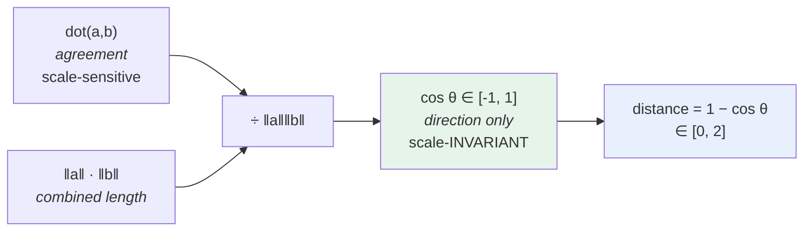
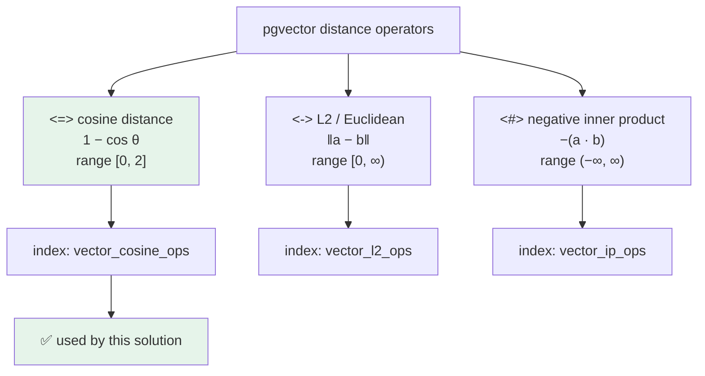

# Cosine Similarity & Cosine Distance — Deep Dive

Using the **same six chunks and query vector** from [`08.RerankingCitationsRag/WORKED-EXAMPLE.md`](08.RerankingCitationsRag/WORKED-EXAMPLE.md).

Everything here is 4-dimensional so it stays hand-checkable. `gemini-embedding-001` produces 768 dimensions in this solution — the formulas do not change, only the length of the loops.

---

## 1. The Data

Four synthetic dimensions: `d0` = delay/tracking, `d1` = escalation/investigation, `d2` = damage/claims, `d3` = credentials.

| Ref | Title | `d0` | `d1` | `d2` | `d3` |
|---|---|---|---|---|---|
| **q** | *query: "package no movement 48 hours"* | 0.85 | 0.45 | 0.05 | 0.00 |
| C1 | Lost Package Policy — Escalation | 0.90 | 0.40 | 0.10 | 0.00 |
| C2 | Lost Package Policy — Definitions | 0.80 | 0.10 | 0.10 | 0.00 |
| C3 | Damaged Shipment Procedure | 0.20 | 0.30 | 0.90 | 0.00 |
| C4 | Password Reset Procedure | 0.00 | 0.10 | 0.00 | 0.95 |
| C5 | Investigation Team Charter | 0.30 | 0.90 | 0.20 | 0.00 |
| C6 | Customs Delay Guidance | 0.70 | 0.20 | 0.20 | 0.10 |

---

## 2. The Three Ingredients

### 2.1 Dot product — "how much do they agree?"

$$
\mathbf{a}\cdot\mathbf{b} = \sum_{i=0}^{n-1} a_i b_i
$$

This is the raw agreement signal. It is large when both vectors are large **and** point the same way. That conflation is the problem cosine solves.

```csharp
double dot = 0;
for (var i = 0; i < a.Length; i++) dot += a[i] * b[i];
```

### 2.2 Magnitude (L2 norm) — "how long is it?"

$$
\lVert \mathbf{a} \rVert = \sqrt{\sum_{i=0}^{n-1} a_i^2}
$$

For text embeddings, length roughly tracks *how much text / how emphatic*, not *what it is about*.

### 2.3 Cosine similarity — "what angle is between them?"

$$
\cos\theta = \frac{\mathbf{a}\cdot\mathbf{b}}{\lVert\mathbf{a}\rVert\,\lVert\mathbf{b}\rVert}
$$

Dividing by both magnitudes **cancels length entirely**. What remains is pure direction — which, in embedding space, is meaning.



---

## 3. One Pair, Fully Long-Hand: q vs C1

```
q  = [0.85, 0.45, 0.05, 0.00]
C1 = [0.90, 0.40, 0.10, 0.00]
```

**Step 1 — element-wise products**

| i | `q[i]` | `C1[i]` | product |
|---|---|---|---|
| 0 | 0.85 | 0.90 | 0.7650 |
| 1 | 0.45 | 0.40 | 0.1800 |
| 2 | 0.05 | 0.10 | 0.0050 |
| 3 | 0.00 | 0.00 | 0.0000 |
| | | **dot** | **0.9500** |

**Step 2 — magnitudes**

```
‖q‖  = √(0.85² + 0.45² + 0.05² + 0²)
	 = √(0.7225 + 0.2025 + 0.0025 + 0)
	 = √0.9275  = 0.96307

‖C1‖ = √(0.90² + 0.40² + 0.10² + 0²)
	 = √(0.8100 + 0.1600 + 0.0100 + 0)
	 = √0.9800  = 0.98995
```

**Step 3 — divide**

```
‖q‖ × ‖C1‖ = 0.96307 × 0.98995 = 0.95339

cos θ = 0.9500 / 0.95339 = 0.99644
```

**Step 4 — interpret as an angle**

```
θ = arccos(0.99644) = 0.08441 rad = 4.84°
```

**Step 5 — convert to distance (what pgvector's `<=>` returns)**

```
distance = 1 − 0.99644 = 0.00356
```

C1 sits **4.84° away from the query**. Nearly the same direction — nearly the same meaning.

---

## 4. All Six, Side by Side

| Ref | dot | ‖d‖ | cos θ (similarity) | θ | `<=>` distance = 1−cos |
|---|---|---|---|---|---|
| **C1** | 0.9500 | 0.98995 | **0.99644** | **4.84°** | 0.00356 |
| **C6** | 0.6950 | 0.76158 | **0.94759** | **18.63°** | 0.05241 |
| **C2** | 0.7300 | 0.81240 | **0.93304** | **21.09°** | 0.06696 |
| **C5** | 0.6700 | 0.96954 | **0.71754** | **44.15°** | 0.28246 |
| **C3** | 0.3500 | 0.96954 | **0.37483** | **67.99°** | 0.62517 |
| **C4** | 0.0450 | 0.95525 | **0.04891** | **87.20°** | 0.95109 |

*(‖q‖ = 0.96307 throughout.)*

### Similarity bar chart

```
					0.0       0.2       0.4       0.6       0.8       1.0
					 |---------|---------|---------|---------|---------|
C1  Lost Pkg/Escal.  ████████████████████████████████████████████████▉  0.9964   4.8°
C6  Customs Delay    ██████████████████████████████████████████████▍    0.9476  18.6°  ⚠ distractor
C2  Lost Pkg/Defs.   █████████████████████████████████████████████▋     0.9330  21.1°
C5  Investig. Chart. ██████████████████████████████████▉                0.7175  44.2°  ← the one we want
C3  Damaged Shipment █████████████████▉                                 0.3748  68.0°
C4  Password Reset   ██▍                                                0.0489  87.2°
```

**The problem this picture exposes:** C6 (0.9476) beats C5 (0.7175) by a wide margin, yet C5 is the useful document and C6 is noise. Cosine similarity measures *topical proximity*, not *answer-worthiness*. Hence hybrid search and reranking in project 08.

---

## 5. The Geometry, Visualised

### 5.1 Angle fan (projected onto the `d0`–`d1` plane)

Because C1, C2, C5 and C6 carry almost no mass in `d2`/`d3`, plotting `d1` against `d0` is a fair picture for them. Angle from the `d0` axis is `atan2(d1, d0)`:

```
 d0 axis                                                          d1 axis
   0°                                                               90°
   |                                                                 |
   ├── C2 ────── C6 ─────── C1 ─── q ──────────── C3* ────── C5 ──── C4*
	  7.1°      16.0°      24.0°  27.9°          56.3°      71.6°   90.0°
		\________/  \______/  \_/    \_____________/ \_______/
		  Δ 8.9°     Δ 8.0°   Δ3.9°      Δ 28.4°       Δ 15.3°

							  ↑
						 the query
```

**Read it as: the closer a label sits to `q`, the higher its cosine similarity.** C1 is 3.9° away → 0.9964. C5 is 43.7° away → 0.7175.

> `*` **C3 and C4 are distorted in this projection.** Their meaning lives in the dropped dimensions (`d2 = 0.90` for C3, `d3 = 0.95` for C4). In true 4-D their angles from `q` are 68.0° and 87.2°, not 28.4° and 62.1°. This is exactly why you cannot reason about 768-D embeddings from a 2-D plot — **projection always lies**.

### 5.2 Scatter of the `d0`–`d1` plane

```
 d1
1.0 |
	|        ● C5 (0.30, 0.90)
0.9 |        Investigation Charter
	|
0.8 |
	|
0.7 |
	|
0.6 |
	|
0.5 |                                          ★ q (0.85, 0.45)
	|                                        ╱   THE QUERY
0.4 |                                      ╱   ● C1 (0.90, 0.40)
	|                                    ╱     Lost Pkg / Escalation
0.3 |    ● C3 (0.20, 0.30)             ╱
	|    Damaged Shipment            ╱
0.2 |                       ● C6 (0.70, 0.20)
	|                       Customs Delay
0.1 |● C4 (0.00, 0.10)                 ● C2 (0.80, 0.10)
	| Password Reset                    Lost Pkg / Definitions
0.0 +----+----+----+----+----+----+----+----+----+----+
   0.0  0.1  0.2  0.3  0.4  0.5  0.6  0.7  0.8  0.9  1.0   d0
```

**Cosine cares only about the angle of the ray from the origin to each dot — never how far along the ray the dot sits.** C1 and q lie on almost the same ray, so their cosine is ~0.996 even though the dots are visibly apart.

### 5.3 The triangle relationship

For any two vectors, cosine is the Law of Cosines rearranged:

```
					C1
					●
				   /|
				  / |
		  ‖C1‖   /  |
		0.98995 /   |   chord ‖q̂ − Ĉ1‖ (on the unit sphere)
				/   |
			   / θ  |
	   origin ●─────●  q
			  4.84°   ‖q‖ = 0.96307

		cos θ = (q · C1) / (‖q‖ ‖C1‖)
```

---

## 6. Normalisation — the shortcut that changes everything

A **unit vector** (norm 1) is the original divided by its own length:

$$
\hat{\mathbf{a}} = \frac{\mathbf{a}}{\lVert \mathbf{a} \rVert}
$$

| Ref | Unit vector `[d0, d1, d2, d3]` |
|---|---|
| **q̂** | `[0.88259, 0.46726, 0.05192, 0.00000]` |
| Ĉ1 | `[0.90914, 0.40406, 0.10102, 0.00000]` |
| Ĉ2 | `[0.98474, 0.12309, 0.12309, 0.00000]` |
| Ĉ3 | `[0.20628, 0.30943, 0.92828, 0.00000]` |
| Ĉ4 | `[0.00000, 0.10469, 0.00000, 0.99450]` |
| Ĉ5 | `[0.30943, 0.92828, 0.20628, 0.00000]` |
| Ĉ6 | `[0.91915, 0.26261, 0.26261, 0.13130]` |

**Once both vectors are unit length, the denominator becomes 1 and cosine similarity *is* the dot product:**

```
q̂ · Ĉ1 = 0.88259(0.90914) + 0.46726(0.40406) + 0.05192(0.10102) + 0
	   = 0.80243 + 0.18879 + 0.00524
	   = 0.99646        ✓ (matches 0.99644, difference is rounding)
```

That is why production vector stores normalise on write: it turns a division-heavy operation into a bare dot product — much cheaper across millions of 768-dim rows.

> ⚠️ **Real-world caveat for this solution.** `gemini-embedding-001` is a Matryoshka model that natively emits 3072 dimensions. This code requests `OutputDimensionality = 768`, which **truncates** the vector — and a truncated vector is **no longer unit length**. Google's guidance is to **re-normalise after truncating**. Cosine similarity is scale-invariant so ranking still works here, but if you ever switch to the inner-product operator (`<#>`) or compare across differently-truncated sets, un-normalised vectors will give wrong answers.

---

## 7. Cosine vs Euclidean — and why they agree

For **unit vectors**, squared Euclidean distance expands to:

$$
\lVert \hat{a} - \hat{b} \rVert^2 = \lVert\hat a\rVert^2 + \lVert\hat b\rVert^2 - 2(\hat a \cdot \hat b) = 2 - 2\cos\theta
$$

so

$$
\lVert \hat{a} - \hat{b} \rVert = \sqrt{2 - 2\cos\theta} = 2\sin\!\left(\tfrac{\theta}{2}\right)
$$

| Ref | cos θ | cosine distance `1−cos` | L2 on unit vectors `√(2−2cos)` | `2 sin(θ/2)` check |
|---|---|---|---|---|
| C1 | 0.99644 | 0.00356 | 0.08438 | 2 sin(2.42°) = 0.08444 ✓ |
| C6 | 0.94759 | 0.05241 | 0.32376 | 2 sin(9.32°) = 0.32379 ✓ |
| C2 | 0.93304 | 0.06696 | 0.36595 | 2 sin(10.55°) = 0.36598 ✓ |
| C5 | 0.71754 | 0.28246 | 0.75161 | 2 sin(22.08°) = 0.75165 ✓ |
| C3 | 0.37483 | 0.62517 | 1.11819 | 2 sin(34.00°) = 1.11823 ✓ |
| C4 | 0.04891 | 0.95109 | 1.37920 | 2 sin(43.60°) = 1.37923 ✓ |

**The ordering is identical in every column.** `√(2−2cos)` is a strictly decreasing function of `cos`, so:

> On **normalised** vectors, cosine distance and Euclidean distance produce **exactly the same ranking**. They differ only in the numbers, never the order.

This is why swapping `vector_cosine_ops` for `vector_l2_ops` on normalised data is safe — and why it is **catastrophic on un-normalised data**.

---

## 8. Why Cosine and Not Raw Distance — the decisive demo

Take C1 and simply **make it three times longer**. Same direction, same meaning — imagine the same policy restated at triple length.

```
C1    = [0.90, 0.40, 0.10, 0.00]        ‖C1‖    = 0.98995
C1×3  = [2.70, 1.20, 0.30, 0.00]        ‖C1×3‖  = 2.96985
```

| Metric | q vs C1 | q vs C1×3 | Verdict |
|---|---|---|---|
| Dot product | 0.9500 | **2.8500** | ❌ tripled |
| Raw Euclidean `‖q − d‖` | 0.08660 | **2.01184** | ❌ 23× worse |
| **Cosine similarity** | **0.99644** | **0.99644** | ✅ **identical** |

**Working for raw Euclidean:**
```
q − C1   = [-0.05,  0.05, -0.05, 0]  → √(0.0025×3)              = √0.0075  = 0.08660
q − C1×3 = [-1.85, -0.75, -0.25, 0]  → √(3.4225 + 0.5625 + 0.0625) = √4.0475 = 2.01184
```

**Working for cosine:**
```
dot(q, C1×3) = 3 × 0.9500 = 2.8500
‖C1×3‖       = 3 × 0.98995 = 2.96985
cos          = 2.8500 / (0.96307 × 2.96985) = 2.8500 / 2.86017 = 0.99644   ← the 3s cancel
```

The scalar `3` appears in both numerator and denominator and **cancels exactly**. That is the whole argument for cosine in text retrieval: *a long document about X and a short document about X should be equally retrievable for a query about X.*

---

## 9. pgvector Operator Reference



All three are **distance-like: smaller = closer**, which is why the SQL reads `ORDER BY … ASC` (the default) and then flips the value for display:

```sql
SELECT id, title, text,
	   1 - (embedding <=> @embedding) AS similarity   -- distance → similarity
FROM document_chunks
WHERE status = 'Active'
ORDER BY embedding <=> @embedding                     -- ascending: nearest first
LIMIT @topK;
```

> ⚠️ **The index op-class must match the operator you query with.** A `vector_cosine_ops` HNSW index will **not** be used by a `<->` query — Postgres silently falls back to a sequential scan. Fast on six rows, ruinous on six million. Always `EXPLAIN` your retrieval query.

---

## 10. Range and Sign — what values are actually possible

| cos θ | θ | Meaning | `<=>` distance |
|---|---|---|---|
| `+1.0` | 0° | identical direction | 0.0 |
| `+0.8` | 37° | strongly related | 0.2 |
| `+0.5` | 60° | loosely related | 0.5 |
| `0.0` | 90° | **orthogonal — unrelated** | 1.0 |
| `−0.5` | 120° | opposed | 1.5 |
| `−1.0` | 180° | exact opposite direction | 2.0 |

Our toy vectors are all non-negative, so cosine lands in `[0, 1]` and distance in `[0, 1]`. **Real embeddings contain negative components**, so the full `[-1, 1]` / `[0, 2]` ranges apply. Do not hard-code a `similarity > 0` assumption.

**A calibration warning:** real 768-dim embeddings from the same model cluster tightly — unrelated text often still scores 0.6–0.7, and 0.9+ is common for merely-related text. Absolute thresholds like `if (similarity > 0.8)` are model-specific and brittle. **Ranking is reliable; absolute cutoffs are not.** This is another reason project 08 fuses by *rank* (RRF) rather than by score.

---

## 11. The Code, Annotated

The hand-rolled version from projects 03/04 — one pass, three accumulators:

```csharp
public static double CosineSimilarity(ReadOnlySpan<float> a, ReadOnlySpan<float> b)
{
	double dot = 0;          // Σ aᵢbᵢ      → agreement
	double magnitudeA = 0;   // Σ aᵢ²       → ‖a‖ before the sqrt
	double magnitudeB = 0;   // Σ bᵢ²       → ‖b‖ before the sqrt

	for (var i = 0; i < a.Length; i++)
	{
		dot        += a[i] * b[i];
		magnitudeA += a[i] * a[i];
		magnitudeB += b[i] * b[i];
	}

	return magnitudeA == 0 || magnitudeB == 0
		? 0                                                   // guard: zero vector has no direction
		: dot / (Math.Sqrt(magnitudeA) * Math.Sqrt(magnitudeB));
}
```

Three points worth noticing:

1. **Single pass.** All three sums accumulate in one loop — cache-friendly.
2. **`double` accumulators over `float` inputs.** Summing 768 `float` products in `float` accumulates rounding error; the wider accumulator is deliberate.
3. **The zero guard.** A zero vector has no direction, so the angle is undefined. Returning `0` avoids `NaN` propagating silently into your ranking. (Project 03 additionally throws on length mismatch — the dimension-drift tripwire.)

From project 05 onward this loop moves into PostgreSQL, where pgvector runs it SIMD-accelerated and, with HNSW, skips most comparisons entirely.

---

## 12. Summary Card

| Concept | Formula | This example |
|---|---|---|
| Dot product | `Σ aᵢbᵢ` | q·C1 = 0.9500 |
| Magnitude | `√(Σ aᵢ²)` | ‖q‖ = 0.96307 |
| Cosine similarity | `dot / (‖a‖‖b‖)` | 0.99644 |
| Angle | `arccos(cos θ)` | 4.84° |
| Cosine distance (`<=>`) | `1 − cos θ` | 0.00356 |
| Similarity from distance | `1 − (a <=> b)` | the SQL projection |
| Unit vector | `a / ‖a‖` | q̂ = `[0.883, 0.467, 0.052, 0]` |
| Cosine on unit vectors | `â · b̂` | plain dot product |
| L2 ↔ cosine (unit) | `√(2 − 2cos θ) = 2 sin(θ/2)` | 0.08438 |
| Scale invariance | `cos(a, kb) = cos(a, b)` | ×3 changed nothing |

**The one-line takeaway:** cosine similarity throws away *how much* and keeps *which way* — and in embedding space, direction is meaning.
