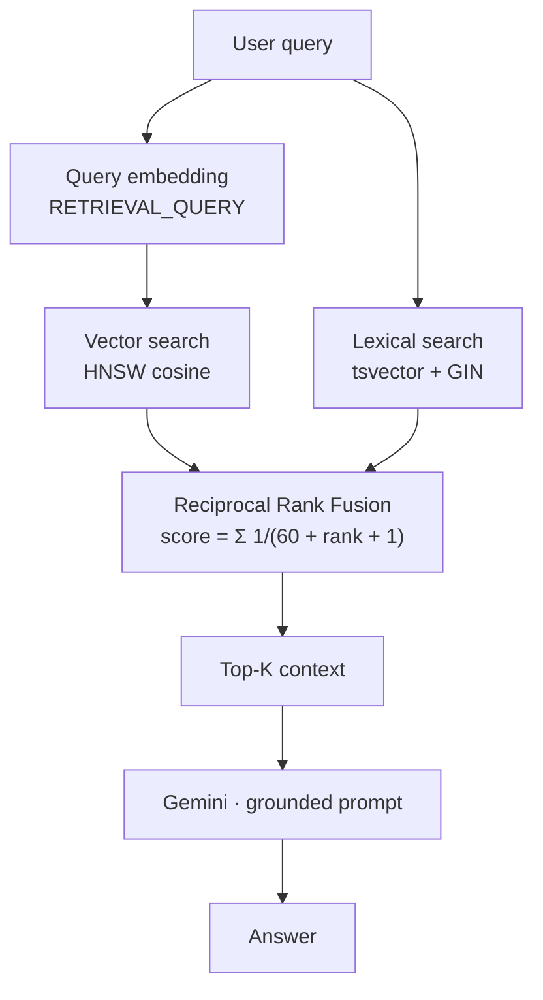
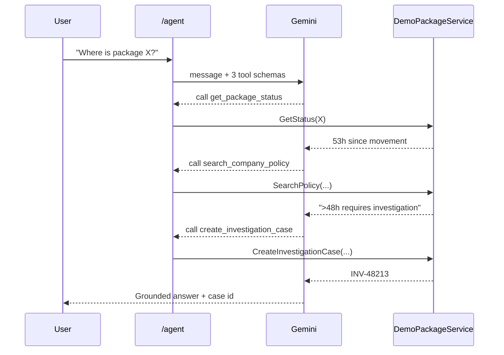

# GenAI Learning Path — Solution Overview

A guided, incremental walkthrough of building a production-shaped **RAG (Retrieval-Augmented Generation)** and **tool-calling agent** stack on **.NET 8 + ASP.NET Core Minimal APIs + Google Gemini (Vertex AI)**.

Each project is **self-contained and deliberately duplicated** (no shared class library). That is intentional: you can diff project *N* against project *N-1* and see exactly what one concept added.

---

## 1. The Learning Ladder

```mermaid
graph LR
	P1["01 DirectGemini<br/>raw LLM call"] --> P2["02 StructuredGemini<br/>JSON schema output"]
	P2 --> P3["03 IntroducingRag<br/>embeddings + cosine"]
	P3 --> P4["04 AddedVectorToRag<br/>IVectorStore abstraction"]
	P4 --> P5["05 PgvectorRag<br/>Postgres + pgvector"]
	P5 --> P6["06 DocumentIngestionRag<br/>chunking + metadata"]
	P6 --> P7["07 HybridSearchRag<br/>BM25-ish FTS + RRF"]
	P7 --> P8["08 RerankingCitationsRag<br/>rerank + grounded citations"]
	P8 --> P9["09 ToolCallingFoundation<br/>function calling agent"]

	subgraph Prompting
		P1
		P2
	end
	subgraph Retrieval
		P3
		P4
		P5
		P6
	end
	subgraph "Retrieval Quality"
		P7
		P8
	end
	subgraph Agents
		P9
	end
```



---

## 2. Cross-Cutting Building Blocks

These types repeat in projects 03–08. Learn them once.

| Type | What it does | Why it exists |
|---|---|---|
| `GoogleCloudOptions` | Strongly typed bind of the `GoogleCloud` config section (`ProjectId`, `Location`, `GeminiModel`, `EmbeddingModel`, `EmbeddingDimensions`). | Removes magic strings; makes model/dimension a **config decision**, not a code change. |
| `GeminiClientFactory` | One-liner that news up `Google.GenAI.Client(project, location, enterprise: true)`. | `enterprise: true` = **Vertex AI** path (uses ADC / service account) instead of the public API-key endpoint. Centralised so auth mode is decided in one place. |
| `IEmbeddingService` / `GeminiEmbeddingService` | Wraps `EmbedContentAsync`; exposes `GenerateDocumentEmbeddingAsync` and `GenerateQueryEmbeddingAsync`. | **Key point:** the two methods differ *only* by `TaskType` — `RETRIEVAL_DOCUMENT` vs `RETRIEVAL_QUERY`. Asymmetric embedding materially improves recall; using the wrong task type silently degrades quality. Also sets `OutputDimensionality` (768) and `AutoTruncate = true`. |
| `PostgresFactory` | `NpgsqlDataSourceBuilder(...).UseVector().Build()`. | `UseVector()` registers the pgvector type mapper so `Pgvector.Vector` can be passed as a normal Npgsql parameter. Without it you get a type-mapping exception. |

**Default configuration** (all projects): `gemini-2.5-flash`, `gemini-embedding-001`, **768 dims**, location `global`.

---

## 3. Project-by-Project

### 01 · DirectGemini — "Hello, LLM"
**What:** A single `GET /ask?q=...` endpoint that forwards the query straight to Gemini and returns `Candidates[0].Content.Parts[0].Text`.

**How:** `new Client(project, location, enterprise: true)` → `client.Models.GenerateContentAsync(model, contents)`.

**Why it's like this:** Strip everything away to prove connectivity, ADC auth and model availability *before* adding complexity.

> ⚠️ **Remember:** the fallback model literal here is `gemini-3.7-flash` while every other project defaults to `gemini-2.5-flash`. Keep `appsettings.json` authoritative.

---

### 02 · StructuredGemini — Deterministic, typed output
**What:** `POST /api/analyze` classifies an incident description into `{ category, priority, summary }`.

**How:** `GenerateContentConfig` sets:
- `SystemInstruction` — role/behaviour ("Classify operational incidents. Do not invent facts.")
- `Temperature = 0.1` — near-deterministic
- `ResponseMimeType = "application/json"` + `ResponseJsonSchema` — **constrained decoding**

Then `JsonSerializer.Deserialize<AnalysisResult>` into a record.

**Why:** Prompt-engineering "please reply in JSON" is unreliable. A schema makes the model *structurally incapable* of returning malformed output, so the LLM becomes a callable API rather than a text generator.

**Remember:** low temperature + system instruction + schema is the standard trio for any classification/extraction step.

---

### 03 · IntroducingRag — Embeddings and cosine similarity from scratch
**What:** Seeds 3 hard-coded policy documents at startup, exposes `GET /search` (raw hits) and `GET /ask` (grounded answer).

**How:**
1. Embed each doc with `RETRIEVAL_DOCUMENT`.
2. Embed the query with `RETRIEVAL_QUERY`.
3. `VectorMath.CosineSimilarity` (hand-written loop) over every chunk — brute force O(n).
4. Take top 3 → stuff into a prompt: *"Use only the context. If insufficient, say so."*

**Why hand-rolled math:** so you can see that a "vector database" is just dot-product / magnitude arithmetic. No magic.

**Remember:** the grounding instruction ("use only the context, else say so") is the anti-hallucination guardrail — it appears in every later project.

---

### 04 · AddedVectorToRag — Abstraction, not new capability
**What:** Functionally identical to 03, but restructured.

**How:** Introduces `IVectorStore` (`Add` / `GetAll`) with `InMemoryVectorStore`, and `SemanticSearchService(IEmbeddingService, IVectorStore)` owning the search algorithm. `DocumentChunk` gains a `DocumentId` (chunk ≠ document).

**Why:** Creates the seam that project 05 swaps out for PostgreSQL. **This is the whole lesson** — isolate storage behind an interface *before* you need to change it.

---

### 05 · PgvectorRag — Real vector database
**What:** Same endpoints, but retrieval now happens **inside PostgreSQL**.

**How:**
- `schema.sql`: `CREATE EXTENSION vector`, `document_chunks` table with rich metadata (`country`, `department`, `version`, `status`, `source_uri`) and `embedding vector(768)`.
- Index: `USING hnsw (embedding vector_cosine_ops)`.
- Query: `ORDER BY embedding <=> @embedding LIMIT @topK`, projecting `1 - (embedding <=> @embedding) AS similarity`.
- `AddAsync` uses `INSERT ... ON CONFLICT (id) DO UPDATE` and only reads `WHERE status = 'Active'`.
- `/ask` now also returns a `sources` array.

**Why:**
- `<=>` is pgvector's **cosine distance** operator; `1 - distance` converts it back to similarity for humans.
- **HNSW** gives approximate-nearest-neighbour in ~log time. Brute force (project 03) does not survive contact with real corpora.
- `status`-based soft delete + upsert = re-ingest safely without orphaned rows.
- Metadata columns exist *now* so filtering (tenant, country, version) is a `WHERE` clause later, not a migration.

**Remember:** the vector dimension in the schema (`768`) **must** match `EmbeddingDimensions` in config. Mismatch = runtime failure. Also, the index op-class (`vector_cosine_ops`) must match the distance operator you query with.

---

### 06 · DocumentIngestionRag — Turning documents into chunks
**What:** Adds `POST /documents` which accepts a `SourceDocument` and returns the number of chunks indexed.

**How:**
- `ParagraphDocumentChunker(maxCharacters = 1500)` splits on blank lines and greedily packs paragraphs until the budget is hit — so chunks end on **semantic boundaries**, never mid-sentence.
- `DocumentIngestionService.IndexAsync` embeds each chunk with a **context header** (`Document: {title}` / `Section: {section}` / body) rather than the bare text.
- Chunk identity: `"{documentId}|{version}|{sequence:D4}"` → SHA-256 → first 16 bytes → `Guid`.

**Why:**
- Embedding models have token limits and dilute meaning over long text; chunking is the single biggest lever on retrieval quality.
- The title/section header gives an otherwise-orphaned paragraph its context, which measurably improves the embedding.
- **Deterministic GUIDs** mean re-ingesting the same document version updates rows in place (idempotent) instead of duplicating them — this is what makes `ON CONFLICT DO UPDATE` from project 05 useful.

**Remember:** versioned chunk IDs let you keep v1 and v2 of a document side by side and retire the old one by flipping `status`.

---

### 07 · HybridSearchRag — Semantic + keyword, fused
**What:** `/search` and `/ask` now run two retrievers in parallel and merge them.

**How:**
- Schema adds a **generated** `search_vector tsvector` column (`to_tsvector('english', title || section || text)`), `STORED`, indexed with **GIN**.
- `SearchTextAsync` uses `plainto_tsquery` + `ts_rank_cd`.
- `HybridRetrievalService` fires `SearchVectorAsync(20)` and `SearchTextAsync(20)` concurrently via `Task.WhenAll`.
- `ReciprocalRankFusion.Fuse` scores each doc as `Σ 1 / (k + rank + 1)` with `k = 60`, then takes top-K.



**Why:**
- Vector search fails on **exact tokens** — error codes, SKUs, acronyms, proper nouns. Keyword search fails on **paraphrase**. Hybrid covers both blind spots.
- **RRF fuses by rank, not score.** Cosine similarity and `ts_rank_cd` live on incompatible scales, so normalising them is guesswork; ranks are always comparable. The `k = 60` constant damps the influence of top positions and is the widely used default.
- `GENERATED ALWAYS ... STORED` means the search vector can never drift out of sync with the text.

**Remember:** over-fetch (20 each) then fuse down to 5–10. Fusing only the top 3 of each list wastes the recall you paid for.

---

### 08 · RerankingCitationsRag — Precision and provable grounding
**What:** A single `GET /ask` returning `{ answer, sourceIds, sources }`.

**How — two additions on top of 07:**

1. **Reranking.** `RetrievalPipeline` = vector(20) + lexical(20) → RRF(20) → `IReranker.RerankAsync(query, candidates, topK: 5)`. `LightweightLexicalReranker` scores candidates by how many distinct query terms appear in title/text.
2. **Validated citations.** The prompt says *"Answer only from supplied sources and cite SOURCE_ID values"*, and a JSON schema forces `{ answer, sourceIds[] }`. The code then intersects the returned IDs with `allowedIds` — the set actually retrieved — and returns only survivors, hydrated with `Title`, `Section`, `SourceUri`.

**Why:**
- Retrieval optimises **recall** (don't miss it); reranking optimises **precision** (put the best first). LLMs weight early context most heavily, so ordering matters.
- `IReranker` is an interface for the same reason `IVectorStore` was: swap the naive term-overlap scorer for a cross-encoder or Vertex AI Ranking API without touching the pipeline.
- **The `allowedIds` intersection is the highlight of the project.** Asking a model to cite is a request; *verifying* the citations against retrieved IDs is an enforcement. Fabricated references are dropped structurally, not hoped away.

**Remember:** never render a citation the model produced without checking it came from your own retrieval set.

📄 **See [`08.RerankingCitationsRag/WORKED-EXAMPLE.md`](08.RerankingCitationsRag/WORKED-EXAMPLE.md)** for a full end-to-end trace of this project with sample data and every cosine / `ts_rank_cd` / RRF / rerank number computed by hand.

---

### 09 · ToolCallingFoundation — From answering to acting
**What:** `POST /agent` takes a message and lets Gemini decide which tools to call.

**How:**
- Bridges to `Microsoft.Extensions.AI`: `genai.AsIChatClient(model).AsBuilder().UseFunctionInvocation().Build()`.
- Three `AIFunctionFactory.Create(...)` tools over `DemoPackageService`:
  - `get_package_status` → returns `lastMovementHours = 53`
  - `search_company_policy` → returns "no movement > 48 hours requires an investigation case"
  - `create_investigation_case` → side-effecting; described as *"Use only when retrieved policy and package state indicate an investigation is required."*
- Parameters carry `[Description]` attributes.



**Why:**
- `UseFunctionInvocation()` runs the **tool loop automatically** — model requests a call, the middleware executes the C# method, feeds the result back, and repeats until a final answer. You never hand-write that state machine.
- Tool `name` and `description`, plus `[Description]` on each parameter, **are the prompt** for tool selection. Vague descriptions are the #1 cause of wrong tool choice.
- The scenario (53h > 48h threshold) is designed to force **multi-step reasoning**: read state → read policy → act. That is the leap from RAG to an agent.

**Remember:** guard side-effecting tools in their description *and* in code. Descriptions steer the model; they do not constrain it.

---

## 4. Consolidated Cheat Sheet

| Concept | Where introduced | Non-obvious detail |
|---|---|---|
| Vertex AI auth | 01 | `enterprise: true` + `gcloud auth application-default login` |
| Constrained JSON output | 02 | `ResponseMimeType` **and** `ResponseJsonSchema` — both required |
| Asymmetric embeddings | 03 | `RETRIEVAL_DOCUMENT` vs `RETRIEVAL_QUERY` task types |
| Storage abstraction | 04 | Add the seam before you need it |
| pgvector cosine | 05 | `<=>` is distance; similarity = `1 - <=>` |
| ANN index | 05 | HNSW op-class must match the query operator |
| Idempotent ingestion | 06 | SHA-256 of `docId\|version\|seq` → deterministic `Guid` |
| Context-enriched embedding | 06 | Prepend title/section before embedding the chunk |
| Hybrid retrieval | 07 | Vector covers paraphrase, FTS covers exact tokens |
| RRF | 07 | Fuse by **rank** (`k=60`), never by raw score |
| Reranking | 08 | Recall from retrieval, precision from reranking |
| Citation validation | 08 | Intersect model-returned IDs with retrieved IDs |
| Tool calling | 09 | `UseFunctionInvocation()` drives the loop; descriptions drive selection |

## 5. Common Pitfalls

- **Dimension drift** — `EmbeddingDimensions` (config) must equal `vector(768)` (schema).
- **Model literals in code** — 01 hard-codes a different fallback model than the rest; trust `appsettings.json`.
- **Sequential embedding in ingestion (06)** — the chunk loop is `await`-per-chunk. Fine for a demo, needs batching/parallelism for real corpora.
- **No `status` filter on the FTS index (07)** — the query filters `status = 'Active'` but the GIN index doesn't; consider a partial index at scale.
- **Reranker in 08 is term-overlap only** — a genuine relevance model (cross-encoder / Vertex Ranking) is the production answer.
- **Projects 05–08 need PostgreSQL + pgvector** — run each project's `schema.sql` first.

## 6. Running

```bash
gcloud auth application-default login
dotnet restore GenAiLearningPath.sln
dotnet build GenAiLearningPath.sln
# Projects 05-08 additionally require Postgres with pgvector, seeded via schema.sql
dotnet run --project 07.HybridSearchRag/07-HybridSearchRag.csproj
```
